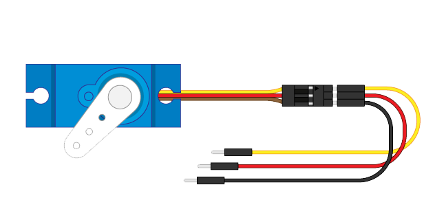
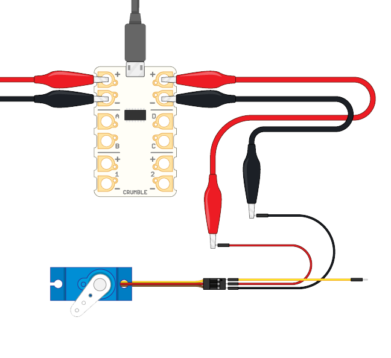

Jumper cables are standard electronics cables that you can use to connect components to breadboards, Raspberry Pi computers, and microcontrollers. Jumper cables can have 'male' ends with a small metal pin, or 'female' ends with a socket. 

To connect a servo motor to your Crumble, you need three **male-to-male** jumper cables. Male-to-male jumper cables are the jumper cables with a metal pin on each end.

**Note:** it is best to use jumper cables that match your servo motor cables' colours so it is clear which cable is which. But jumper cables of any colour work correctly.

- Plug the three jumper cables into the servo motor plug. 

- Use a crocodile clip cable to connect the Crumble's positive **+** terminal to the motor's positive **+** jumper cable (connected to the middle cable of the plug, which is usually red).

- Use another crocodile clip cable to connect the Crumble's negative **-** terminal to the motor's negative **-** jumper cable (connected to the motor cable that is usually brown or black).

- Choose which terminal (A, B, C, or D) of the Crumble you want to use to control the servo motor.

- Use a crocodile clip cable to connect the chosen terminal to the motor's signal jumper cable (connected to the motor cable that is opposite the negative cable and usually orange or white).

**Important:**

- Be careful **not to pull apart** the connected crocodile clips and jumper cable pins.
- Make sure that the exposed metal parts of the different crocodile clips **never** touch each other when they are connected the jumper cable pins.

You could wrap some electrical insulation tape around the points where the crocodile clips hold the jumper cable pins. This would prevent the clips from touching each other and help the cables stay connected!
