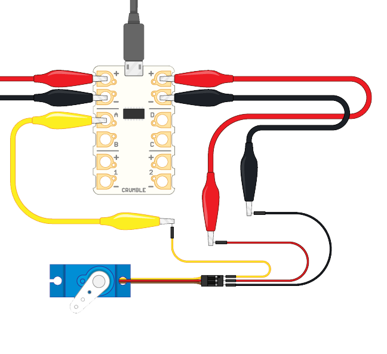

Jumper cables are very standard electronics cables that can be used with breadboards, Raspberry Pi computers and many micro:bit pin out boards. They can have 'male' ends that have a small metal pin or 'female' ends that have a small socket. 

To connect a servo to our Crumble, we will use three male to male jumper cables. In other words, we will use the jumper cables with a metal pin on each end.

It is useful to have cables that match your servo's cable colours so it is clear which cable is which but any colours will work.

Jumper cables are cheap to buy, come in many different lengths and can be used for all sorts of electronics projects. The pins of the cables fit directly into the sockets of the servo plugs which makes them very handy for connecting servos to Crumbles. The connection between the crocodile clips and the jumper cable pins is not the best connection ever and you will need to make sure that the exposed metal parts of the different croc clips do not touch each other when they are connected the jumper cable pins.

Plug the pins of one end of the three jumper cables into end of the servo plug. 

Note: It is ideal to have jumper cables whose colours match those of your servo cable, and it is cetainly an advantage to make sure your three cables are a different colour from each other so that you can tell them apart easily.

Next, connect a crocodile clip between the positive terminal (+) of the Crumble and the positive wire (+) from the servo (the middle one and usually red), and from the negative terminal (-) of the Crumble to the negative wire (-) from the servo (usually brown or black).

Finally, choose which terminal, A, B, C or D, of the Crumble you want to use to control the servo. Connect a crocodile clip between that terminal and the signal wire from the servo (opposite the negative and usally orange or white).

Make sure that the exposed metal parts of your crocodile clips to jumper pin connections are not going to touch each other. If you are worried about this you could wrap some electrical insulation tape around the joins. This would also help the connections stay together!